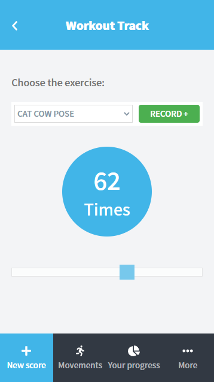
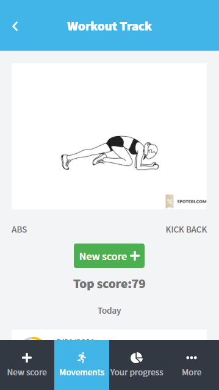
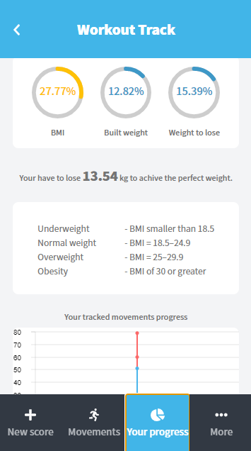

# Workout Track 

> This project is a single-page mobile web app built mainly with React. It is a tool to track your workout and your body status and medical statistics. It's based on my Rails API; workout-track-api.herokuapp.com.


<div align="center"> 






</div>

## Technologies

- Node.js
- React
- React-DOM
- React-Create-App
- React-Redux
- Redux
- npm
- CSS
- ES6

## Live Demo

[Live Demo Link](http://workout-track-mob.herokuapp.com/)

## Usage

```
- git clone "https://github.com/Mohamed-js/workout-track.git"
- cd workout-track
- npm install
- npm start
```

## Testing

```
- git clone "https://github.com/Mohamed-js/workout-track.git"
- cd workout-track
- npm install
- npm test
- press a to run all tests
```

## Authors

👤 **Mohammed Atef**

- GitHub: [Mohamed Atef](https://github.com/Mohamed-js)
- Twitter: [@Mohamed Atef](https://twitter.com/Demovejetta)
- LinkedIn: [LinkedIn](https://www.linkedin.com/in/mohamed-js/)

## 🤝 Contributing

Contributions, issues, and feature requests are welcome!

## Show your support

Give a ⭐️ if you like this project!

## Acknowledgments

- Microverse
- Notion
- Gregoire Vella - Designer
- Behance

## 📝 License

This project is [MIT](https://github.com/Mohamed-js/Capstone-Project-1/blob/dev-area/LICENSE.md) licensed.
